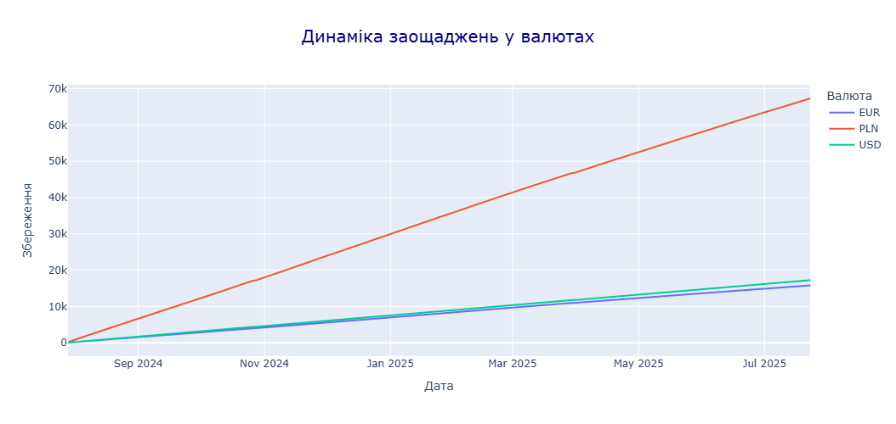
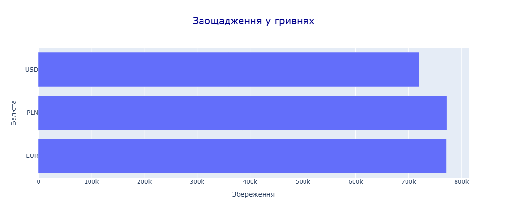

# [UA] Аналіз заощаджень у валюті: порівняння результатів у PLN, EUR та USD

Цей проєкт досліджує те, як щоденні заощадження у різних іноземних валютах можуть змінювати свою вартість з часом на основі реальних історичних курсів із API ПриватБанку.
Аналіз охоплює накопичення у PLN, EUR та USD за останні 360 днів та визначає, яка валюта принесла б найбільшу суму у гривнях при конвертації за курсом останнього дня.

## Мета проєкту
- Отримати історичні курси валют (PLN, EUR, USD) з архіву курсів API ПриватБанку
- Змоделювати щоденні накопичення по 2000 грн, конвертованих у кожну з валют протягом 360 днів
- Розрахувати кумулятивні заощадження в кожній валюті
- Перевести підсумкові суми назад у гривні за курсом останнього дня періоду
- Порівняти результати та визначити відсоткову різницю між валютами
- Візуалізувати динаміку накопичень
- Зберегти оброблені результати у <b>Excel</b> для подальшого аналізу

## Інструменти та технології
- <b>Python</b> (pandas, matplotlib, requests)
- Exploratory Data Analysis (EDA)
- Робота з <b>API</b> та обробка <b>JSON</b>
- Розрахунок кумулятивних значень та валютна конвертація
- Візуалізація для порівняння трендів

## Ключові висновки
- <b>Польський злотий (PLN)</b> дав найбільший обсяг накопичень у гривневому еквіваленті за 360 днів
- Різниця між PLN та EUR майже непомітна — <b>0,11%</b> (~881 грн), що свідчить про однакову ефективність накопичень у цих валютах
- Різниця між PLN та USD суттєва — <b>7,29%</b> (~52 541 грн), що робить USD найменш вигідною валютою у цьому сценарії
- Вибір валюти має значення, але між <b>PLN</b> та <b>EUR</b> вплив майже непомітний на обсязі в річному горизонті

---

# [ENG] Currency Savings Analysis: Comparing Returns in PLN, EUR & USD

This project investigates how daily savings in different foreign currencies would perform over time using real historical exchange rates from the PrivatBank API. 
It compares cumulative returns for PLN, EUR, and USD over the past 360 days and determines which currency would yield the highest final amount when converted back to UAH at the end of the period.

## Project Scope
- Retrieved historical exchange rates for PLN, EUR, and USD from the PrivatBank exchange archive API
- Simulated daily savings of 2000 UAH converted into each currency over 360 days
- Calculated cumulative savings in each currency
- Converted final amounts back to UAH using the last day’s exchange rate
- Compared performance between currencies and calculated percentage differences
- Visualized savings growth trends for each currency
- Saved processed results to <b>Excel</b> for further review

## Tools & Techniques
- <b>Python</b> (pandas, matplotlib, requests)
- Exploratory Data Analysis (EDA)
- <b>API</b> data retrieval and <b>JSON</b> parsing
- Cumulative calculations and currency conversion
- Data visualization for trend comparison

## Key Insights
- The <b>Polish zloty (PLN)</b> produced the highest amount in UAH equivalent after 360 days
- The difference between PLN and EUR returns is minimal — <b>0.11%</b> (~881 UAH), meaning both currencies are almost equally effective for savings
- The difference between PLN and USD returns is significant — <b>7.29%</b> (~52,541 UAH), making USD the least profitable option in this scenario
- Currency choice matters, but between <b>PLN</b> and <b>EUR</b>, the impact is negligible over the analyzed period

